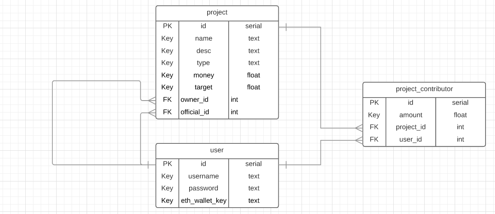

# city-block-server
This is the main server for the city-block project that handles projects and user data

#### ERD:

The purpose of this server is to hold a a database of projects and users for the city-block website.
